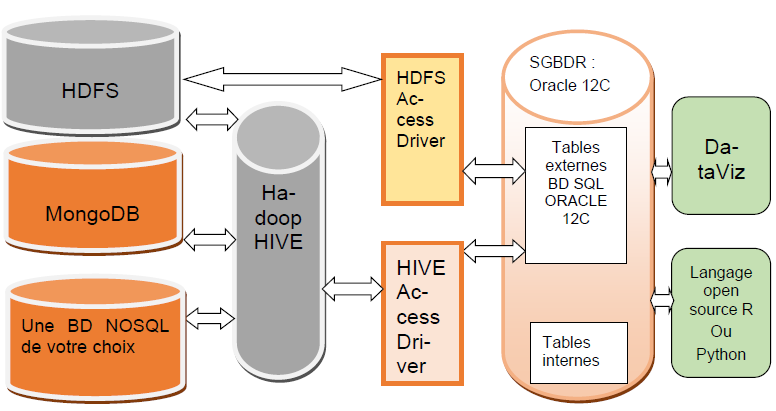
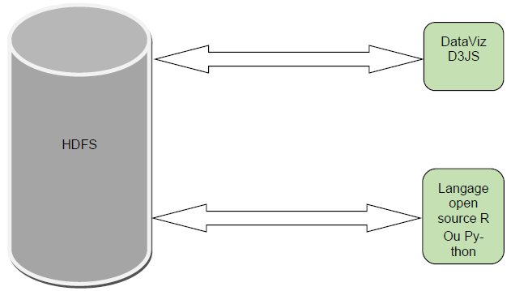

# Membre du Groupe : 
- ABDALLAH Swabahadine
- DIALLO Elhadj Mamadou Foula
- MAMANE LAWEL Sadio 
- NITEKA Lys Ciela
- PAJANY Allan

# Le projet
[Sujet](Sujet/M2_Projet_Cours_BigData_M2MBDS_SOPHIA_2020-2021_Voitures_au_28_10_2020_V4.pdf) du projet.

Le projet s'est réalisé à l'aide de deux architectures. 
Chaque architecture est composée de :
 -  Fichiers Readme
 -  Scripts 
 -  Détails de l'avancé de chaque Sprint
 
Recommandation pour la visuaisation des données : [VSCode](https://code.visualstudio.com/) + plugin [Excel Viewer](https://marketplace.visualstudio.com/items?itemName=GrapeCity.gc-excelviewer).

## Les différents répertoires
-   [Nettoyage](Nettoyage) : Avant de manipuler les données dans les architectures, on doit dabord les néttoyer.
lancer le script sh:
    -   sh _Nettoyage/script_1_init.sh

-   [Architecture 1](Architecture1) : [Scripts](Architecture1/Scripts) - [Sprints](Architecture1/Sprints) - 
[README](Architecture1/README.md)

 

-   [Architecture 2](Architecture2) : [Scripts](Architecture2/Scripts) - [Sprints](Architecture2/Sprints) - 
[README](Architecture2/README.md)

-   [Donnees_Brut](Donnees_Brut) : Données du constructeur automobile.
    
-   [Rapports](Rapports) : Rapports des travaux effecuees sur les différentes parties du projet.
